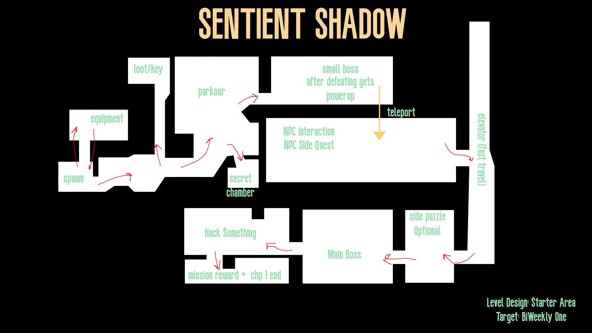

# Sentient Shadow

> Featuring an AI/ML-powered dynamic NPC engine

## Current Progress

- **Storyline (short version):** A group of scientists were experimenting on humans, and the experiments accidentally turned the subjects into monsters. The hero must kill the monsters — or perhaps find a way to cure them instead.
- **Game model:** 2D side-scroller *(flagging this — earlier we discussed it as a top-down RPG; worth double-checking which one is current before this goes further)*
- **Level design for first overworld:**
  

## Immediate Future Plans

- Learn combat design and implementation patterns
- Implement the first overworld level design
- Prototype AI Rival (utility-based behavior states)