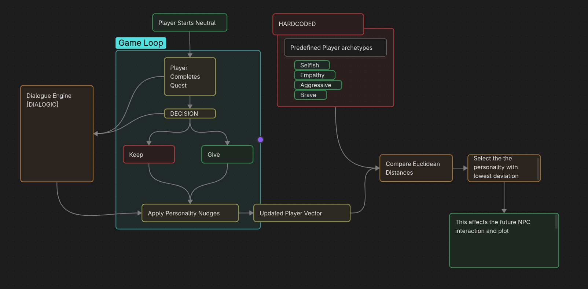

# Sentient Shadow

> **A 2D side-scrolling RPG about survival, identity, and the cost of creating a cure.**

**Sentient Shadow** is a story-driven 2D side-scrolling RPG developed in **Godot 4.7**. The game combines combat, exploration, quests, branching dialogue, and dynamic NPC interactions. Every important decision affects the rival's behavior, relationships, quest outcomes, and ultimately the ending of the game.

The player explores a world devastated by an experimental life-extending drug while searching for a missing family member.

---

## 🎮 Game Overview

A pharmaceutical company developed a drug intended to extend human life.

The experiments went wrong.

The drug caused severe mutations, creating hostile creatures. As society collapsed, the company continued its research in an attempt to create a cure.

The player needs to search for his/her family member and uncover the secrets of the company.

---

## ✨ Features

*  **2D side-scrolling combat**
*  **Exploration across multiple environments**
*  **Story-driven quests and lore**
*  **5 levels**
*  **Branching dialogue using Dialogic**
*  **Dynamic companion personality and reactions**
*  **Player personality system**
*  **Multiple possible endings**
*  **Hidden lore and discoveries**
*  **Replayability through different player decisions**

---

## 🧠 Player Personality System

The game tracks four personality traits:

| Trait          | Description                                       |
| -------------- | ------------------------------------------------- |
| **Compassion** | How much the player helps others                  |
| **Greed**      | How strongly the player prioritizes personal gain |
| **Violence**   | How aggressively the player deals with situations |
| **Courage**    | How willing the player is to take risks           |

Player actions can modify these values.

The personality system affects certain dialogue interactions and contributes to determining the player's ending.

Example personality profiles include:

* **Selfish**
* **Empathetic**
* **Aggressive**
* **Brave**

These values are also synchronized with **Dialogic**, allowing dialogue to react to the player's personality.

---

## Architecture



# 💬 Dialogue System

The game uses **Dialogic** for its dialogue and narrative system.

Dialogues can react to:

* Player personality
* Quest progress
* Previous actions
* Story progression
* Discoveries

This allows NPC conversations to change without requiring every interaction to contain explicit player choices.

For example, an NPC may respond differently depending on whether the player's personality is primarily:

```text
Compassionate
Selfish
Violent
Courageous
```

---

# ⚔️ Combat

Combat is a core part of every level.

The player encounters different types of mutated creatures known as **Shadows**.

Combat focuses on:

* Movement
* Attacks
* Enemy encounters
* Resource management
* Survival

The companion can also react to and assist the player during combat.

---

# 🛠️ Technology

| Technology       | Usage                     |
| ---------------- | ------------------------- |
| **Godot 4.7**    | Game engine               |
| **GDScript**     | Programming               |
| **Dialogic**     | Dialogue and narrative    |
| **Git / GitHub** | Version control           |

---

# 👥 Team

### Developers

* Samyak Kose
* Jiya Choksi
* Hishant Kudalkar

### Mentors

* Awwab Wadekar
* Nathan D'Souza

---

# 📜 License

This project is currently being developed as a game project.

All original game assets, code, characters, story elements, and other project-specific content belong to their respective creators unless otherwise stated.

